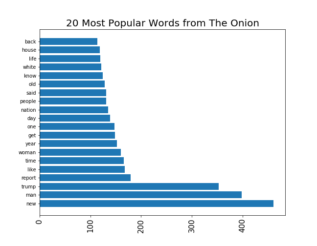
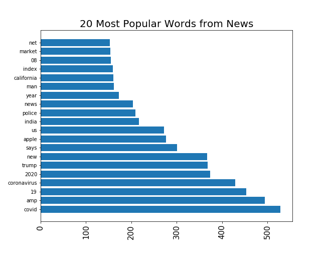
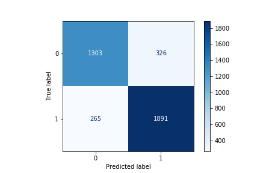
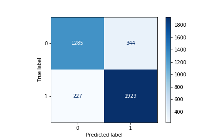

# Predicting Fake News
## Project 3 ReadMe

### Problem Statement
With the rise of social media and click-bait articles comes the rise of pseudo-news. I decided to compare the 'The Onion' subreddit and the 'News' subreddit, two forums from [reddit.com](https://www.reddit.com). I will use subreddit posts from [‘r/theonion’](https://www.reddit.com/r/TheOnion/) and [‘r/news’](https://www.reddit.com/r/news/) to create classification models (specifically logistic regression and support vector model) assessed on accuracy. The models will be used to predict if a post is from The Onion, a satire news-like e-journal, or actual News in order to help users differentiate news from satire.

### Data Collection
I pulled up to 10,000 posts from each subreddit using the [Pushshift API](https://https://github.com/pushshift/api), which was designed to pull submissions and comments from Reddit. Due to constraints from Reddit's site, I pulled 100 posts at a time, up to 100 times. Each pull was 3 seconds apart. This allowed me to pull exactly 10,000 posts from r/news, but I was only able to pull 7,187 posts from r/theonion because that was the total number of the posts on that subreddit.

Each post that is pulled has an associated UTC timestamp from when that post was published. I used the last UTC stamp from each batch of 100 posts to have my code pull my next batch from before that time, so they did not pull any duplicates.

### Data Exploration and Cleaning
When exploring my data, I quickly realized there were some duplicate titles, as multiple users sometimes post the same articles. In order to ensure each title was separated equally, I deleted any duplicates. I also noticed there were many null values in the 'selftext' column, which is meant for any text in the main body of the submission. If the 'selftext' column was not null, it had '[deleted]' in the column. Most likely, this is because the majority of posts on these two subreddits are links to actual articles (either from news sites, or The Onion's site). I decided to delete this column and focus on the title of each post. Lastly, I rennamed the subreddit column data to '0' for 'theonion' and '1' for 'news' in order to make predictions easier.

After cleaning my main dataframe, I vectorized the corpus. Vectorization looks at each word in the title column, and splits each word into its own variable. If the word is present in the title, the column receives a 1 (or higher, if the word appears more than once) for that specific row. I ignored stop words (common words like 'the', 'a', 'it' along with a few specific words which might be a dead giveaway, like 'onion'). Basically, it takes a count of each word in the title of each post and makes one long list (which I converted into a dataframe) of the frequency of every word mentioned in the corpus. I split the vectorized dataframe up into two dataframes separated by subreddit. Then, I was able to determine what the 20 most popular words were in each subreddit. Please see the two bar graphs below of the frequencies of the 20 most popular words.

I was surprised to find that many words relating to Covid-19 were not very popular in The Onion. Because it is such a big, current event, I expected there to be satire about it. However, after more thought, I realized that the pandemic can be a very sensitive topic, so it makes sense that it is not as popular in The Onion, as they do not want to offend many of their readers.  

### Models Used

I ran a total of four classification models: Logistic Regression (LR), K Nearest Neighbors (KNN), Random Forest (RF), and Support Vector Machine (SVM). I decided to focus on my LR and SVM models because they had the highest accuracy scores.

#### LR
I ran a grid search to optimize my parameters for the best logistic regression model I could make. These parameters can be seen in Notebook 4. The LR model had an accuracy of 92.8% on the training data and 84.3% on testing data, meaning there is still a decent amount of variation in the model. Below is the confusion matrix from the LR model. From left to right are the True Negatives, False Negatives, False Positives, True Positives.

The LR model has the following statistics:  

|Statistic         | Percent| Description|  
|------------------|--------| -----------|
|Accuracy          |  84.3% | Total correct predictions|
|Misclassification | 15.7%  | Total incorrect predictions|
|Precision         | 85.3%  | How many of the positive predictions were correct?|
|Specificity       | 80.0%  | Among all of the negatives, how many were predicted correctly?|
|Selectivity       | 87.7%  | Among all of the positives, how many were predicted correctly?|

*In this case, positive is the news, negative is the onion*

Some of the false positive titles (predicted to be from r/news but were actually from r/theonion) from this model were:

<ul>
<li>Benefits Of Open Office Not Extended To CEO
<li>Most Anticipated TV Shows Of 2019
<li>Tips For Taking Care of House Plants
</ul>

Some of the false negative titles (predicted to be from r/theonion but were actually from r/news) from this model were:

<ul>
<li>Falwell’s use of yacht comes under scrutiny
<li>Nike keeps on betting on Zero Waste
<li>Scarred by my Own Hands
</ul>

#### SVM
I was unable to run a grid search to optimize this model as my computer did not have the processing power and then my computer froze when trying to run the grid search (it was expected to take four hours, and 5 hours later was still at the same point.). I had previously run KNN and RF models, but they had low accuracy scores. Adi mentioned in class that this model was one of the best classification models, so I wanted to at least run the default and see how it did. The SVM model had an accuracy of 96.3% on training data and 85.0% on training data. This model can be seen in Notebook 7. Below is the confusion matrix for the SVM model. From left to right are the True Negatives, False Negatives, False Positives, True Positives.

The SVM model has the following statistics:  

|Statistic         | Percent| Description|  
|------------------|--------| -----------|
|Accuracy          |  85.0% | Total correct predictions|
|Misclassification | 15.0%  | Total incorrect predictions|
|Precision         | 84.9%  | How many of the positive predictions were correct?|
|Specificity       | 78.9%  | Among all of the negatives, how many were predicted correctly?|
|Selectivity       | 89.4%  | Among all of the positives, how many were predicted correctly?|

*In this case, positive is the news, negative is the onion*

### Future Directions
I plan to do a grid search to optimize my SVM model when I have more free time/ do not need to use my laptop for anything else.

This model could possibly be used to help moderators filter future reddit posts for either subreddit by helping them determine the 'fakes'.

This model also has the potential to be turned into a filter on Google Chrome (similar to ad blocker) where it could possibly block clickbait masked as real news, so internet users are not misinformed.

### Data Directory

|__ code  
|   |__ 01-notebook-webscraping.ipynb   
|   |__ 02-notebook-eda-cleaning.ipynb   
|   |__ 03-notebook-gridsearch.ipynb  
|   |__ 04-notebook-logistic-regression.ipynb    
|   |__ 05-notebook-knn-regression.ipynb  
|   |__ 06-notebook-random-forest.ipynb    
|   |__ 07-notebook-svm-model.ipynb  
|__ data   
|   |__ cleaned_reddit_posts.csv  
|   |__ posts_df_vec.csv  
|   |__ reddit_posts.csv   
|__ images    
|   |__ logreg_confusion.png  
|   |__ most_popular_news.png  
|   |__ most_popular_onion.png  
|   |__ svm_confusion.png  
|__ Predicting Fake News.pdf  
|__ README.md  

### References
<ul>
<li>https://www.reddit.com/r/TheOnion/
<li>https://www.reddit.com/r/news/
<li>https://github.com/pushshift/api
<li>https://blog.aylien.com/support-vector-machines-for-dummies-a-simple-explanation/#:~:text=Support%20vectors%20are%20the%20data,elements%20of%20a%20data%20set.
<li>Lessons!
</ul>
